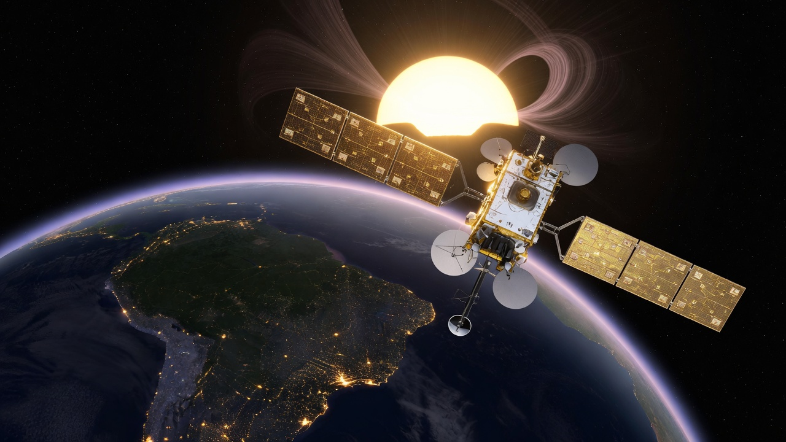
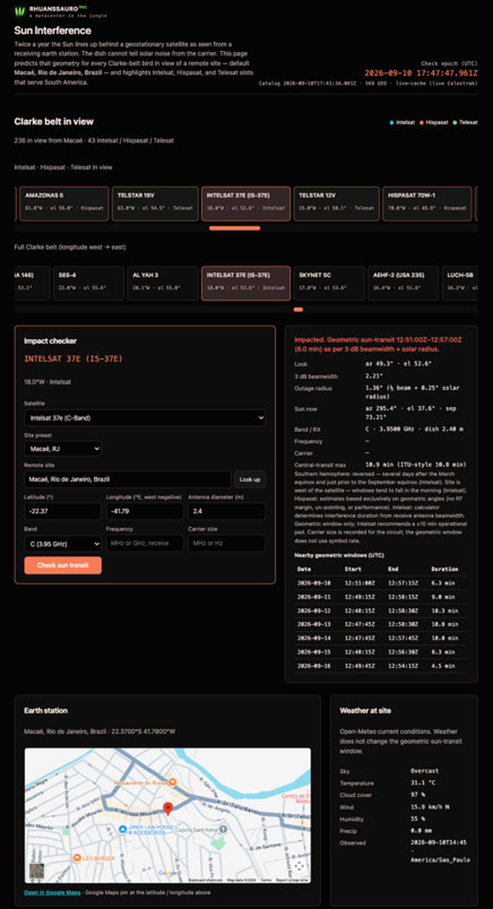

# Rhuanssauro - Sun Interference Calculator



A receiving earth station looking at a geostationary satellite will, twice a year, see the Sun walk into the same line of sight. The dish cannot tell solar thermal noise from the intended carrier. Operators call that sun interference, sun transit, sun fade, or sun outage. This calculator tells you whether a given remote, dish, band, and bird is in that geometry, and if so, when.

The default example site is Macaé, Rio de Janeiro, Brazil. Favorites sit at the top of the satellite list: Intelsat 37e (C and Ku), Telesat T-19, Hispasat H36W, and Intelsat 10-02. Every other Clarke-belt object in view of the site remains selectable.



Example on the page: **Intelsat 37e (C-Band)** at 18.0°W, **Macaé, RJ** (−22.37°, −41.79°), **2.4 m** dish, **C (3.95 GHz)**. Verdict is **Impacted**, geometric sun-transit **12:51:00Z–12:57:00Z (6.0 min)** on 10 September 2026. The table under the verdict is the rest of that Southern-hemisphere window.

## What sun interference is

Geostationary satellites sit on the Clarke belt, roughly 35,786 km above the equator, with a period of one sidereal day. From a correctly pointed earth station they appear fixed in azimuth and elevation. The Sun does not. Its declination crosses the equatorial plane at the March and September equinoxes, and its hour angle changes at about 0.25° per minute.

Intelsat’s *Sun Interference Background* states the cause directly: the Sun passing behind a geostationary satellite as seen from a receiving earth station. For several minutes each day, over several days in the equinox season (February/March and September/October), the Sun is in the equatorial plane that GEO spacecraft occupy. The apparent path then puts the solar disk inside the receive antenna beam.

The Sun is a bright thermal-noise source at the same radio frequencies the satellite uses. Antenna noise temperature rises. G/T falls. C/N and C/I drop. If the link was running close to threshold, the modem loses lock. If it had margin, you still see a fade. The earth station has no way to separate that noise from the wanted signal. That is the outage.

ITU-R S.1525-1 (in force, September 2002) is the method used in FSS planning. Annex 1 covers C/N degradation. Annex 2 predicts date and time from earth-station beamwidth and solar geometry. The half-power beamwidth is estimated as

θ₃dB = 70 × λ / d_ant

with wavelength and antenna diameter in the same units. The Sun’s optical angular diameter is taken as about 0.48°. Because solar hour angle moves at 0.25° per minute, the longest daily transit through the 3 dB beam is about (θ₃dB + 0.48°) / 0.25 minutes. Because declination near the equinoxes changes at about 0.4° per day, the number of affected days at each equinox is about (θ₃dB + 0.48°) / 0.4. ITU notes a typical span of three to nine days, set by antenna diameter.

A concrete check on a 2.4 m Ku dish at 11.95 GHz: λ ≈ 0.025 m, θ₃dB ≈ 0.73°, peak daily duration ≈ 4.8 minutes, on the order of three days around each equinox. A smaller VSAT stays in the beam longer. A teleport-class reflector is in and out faster, but the C/N hit is deeper because the beam is tighter.

Northern-hemisphere stations see the event for several days just before the March equinox and just after the September equinox. Southern-hemisphere stations, including Brazil, see the reverse: after March, before September. Earth stations west of the satellite tend to see morning windows. Stations east of it tend to see afternoon windows. Intelsat’s public calculator labels seasons with Northern Hemisphere names even when the site is south of the equator.

Hispasat’s public calculator is explicit about what it does *not* do. It generates estimates from geometric angles only. It does not take RF link margin, antenna un-pointing, or performance. Intelsat says the same of its geometric mode, and recommends a conservative pad: subtract 10 minutes from the predicted start and add 10 minutes to the predicted end. Telesat’s public tool can run a C/N mode as well as an angle mode. This project matches the geometric method, so the verdict is “the Sun is inside the 3 dB beam,” not “your modem will drop.”

## How often a circuit is actually hit

The phenomenon is seasonal, not daily. Outside the equinox windows there is no sun transit for a GEO receive path. Inside the window you get a short event once per day, for a handful of successive days, then it is gone until the next equinox.

How long each event lasts depends on dish size, downlink frequency, and how close the Sun’s path comes to the satellite that day. Peak day is the central transit. Grazing days at the start and end of the season are shorter. A 1.2 m Ku remote can sit in geometry for the better part of eight minutes on the worst day. An 11 m antenna at 11 GHz, the ITU example, is closer to two and a half minutes, often on only one or two days.

You will not see this on every satellite from a given site on the same clock time. Each orbital slot has its own look angles. A bird at 18°W and a bird at 61°W from Macaé have different azimuths and elevations, so they transit at different UTC hours. That is why a NOC that carries several Atlantic and Americas slots needs a per-circuit check, not a single “equinox week” calendar.

The receive path is the one that cares. Sun interference at *this* earth station is a downlink problem: the frequency the dish is listening on. The remote’s transmit can still be clean while the remote’s receive is in the Sun. The hub can be in its own window at a different time of day because it sits at a different longitude.

## How the calculator applies that

You open a page, pick a satellite, confirm the remote’s latitude and longitude, enter antenna diameter, and set the band or the actual receive frequency. The calculator computes look angles to that GEO slot, the Sun’s apparent position, and the angular separation between the two. Outage is declared while the solar disk (about 0.5°) sits inside the receive 3 dB beam, which we treat as half beamwidth plus 0.25° solar radius.

If the satellite is below the local horizon, the verdict is not in view. If the date is outside both equinox neighbourhoods and no window is found, the verdict is out of season. If a window exists today, you get UTC start, UTC end, and duration. If the season is open but the Sun is not in the beam at this epoch, you get the nearby days that still have a geometric window.

Favorites are listed first so the birds we actually watch in South America are one click away: Intelsat 37e on C and on Ku, Telesat T-19, Hispasat H36W, Intelsat 10-02. The Clarke belt in view of the site is still there underneath, tagged for Intelsat, Hispasat, and Telesat among the full set.

Frequency, when you type it, is the receive frequency and replaces the band-centre default in the beamwidth formula. Carrier size is recorded with the circuit. It does not change the geometric window. Carrier width is an RF-margin question, and this tool does not claim RF margin.

The page is static HTML. There is no account and no scrape of MyIntelsat, Hispasat, or Telesat. Orbital longitudes come from a bundled Celestrak GP `GROUP=geo` snapshot. Live refresh is attempted only when you serve the page over http(s). On `file://` the snapshot is enough to run a check.

Use this to decide whether a fade you are seeing *could* be sun transit, to warn a customer before the season, and to compare two dish sizes on the same slot. Then, in the week of the event, re-run the operator’s own calculator with current ephemeris if you have access. Intelsat asks for that explicitly. Geometry gets you onto the right day and the right hour. Ephemeris tightens the minute.

Official calculators, none of which publish a JSON API:

- [Intelsat / SES](https://my.intelsat.com/si/public/)
- [Hispasat](https://www.hispasat.com/en/useful-information/solar-interference-calculator)
- [Telesat](https://app.telesat.com/sun-transit-calculator)

Celestrak: [GP GROUP=geo](https://celestrak.org/NORAD/elements/gp.php?GROUP=geo&FORMAT=json). One download per catalog update.

## Requirements

You need a current browser (Chrome, Firefox, Safari, or Edge). Python 3.9 or newer is enough to serve the folder. It uses the standard library only. See `requirements.txt`. Node.js 18 or newer is optional, for `npm test` and catalog rebuild. There is no pip package, no bundler, and no compile step.

## Usage

Same path as the screenshot.

1. Open the page (install below, or double-click `index.html`).
2. **Satellite** — Favorites first. Pick **Intelsat 37e (C-Band)** for the example above. The other pins are Intelsat 37e Ku, Telesat T-19, Hispasat H36W, and Intelsat 10-02. The rest of the belt in view of the site is in the same list.
3. **Site** — keep **Macaé, RJ**, or type another remote. Latitude is south-negative. Longitude is east-positive (Macaé is −41.79).
4. **Antenna diameter** — 2.4 m in the example. Smaller dishes stay in the beam longer.
5. **Band / Frequency** — C, Ku, or Ka sets the beamwidth default. If you know the actual receive frequency, type it; that replaces the band centre in θ₃dB = 70 λ / D. There is no inbound/TX field: sun interference at this dish is receive-only. Carrier size is stored with the circuit and does not move the geometric window.
6. **Check sun transit**. Impacted means the solar disk is inside the receive 3 dB beam at this epoch. The table is UTC start, UTC end, and duration for the days that still have a window. Not in view means the bird is below the local horizon. Out of season means no window in either equinox neighbourhood.
7. **Earth station map** — the Google Map below the checker pins the latitude / longitude you entered. **Look up** on the remote-site field geocodes a place name (Open-Meteo) and writes the coordinates. Weather at that pin is Open-Meteo current conditions. It does not change the geometric window.

The Clarke-belt chips above the form are the same catalog. Click a chip or pick from the list; both drive the checker. Map and weather need a network path (`python3 serve.py`); they stay quiet on `file://`.

### macOS

```bash
git clone git@github.com:rhuanssauro/rhuanssauro-sun-interference-calculator.git
cd rhuanssauro-sun-interference-calculator
chmod +x install.sh serve.py
./install.sh
```

Open http://127.0.0.1:8765/. Stop with Ctrl+C. Double-clicking `index.html` also works. Live Celestrak refresh will not run on `file://`.

### Linux

```bash
git clone git@github.com:rhuanssauro/rhuanssauro-sun-interference-calculator.git
cd rhuanssauro-sun-interference-calculator
python3 serve.py --port 8765
```

If `python3` is missing on Debian or Ubuntu: `sudo apt-get update && sudo apt-get install -y python3`. On Fedora: `sudo dnf install -y python3`. Then open http://127.0.0.1:8765/.

### Windows

Install [Python 3](https://www.python.org/downloads/) and tick “Add python.exe to PATH”. Clone with Git for Windows or GitHub Desktop, then:

```powershell
git clone git@github.com:rhuanssauro/rhuanssauro-sun-interference-calculator.git
cd rhuanssauro-sun-interference-calculator
py -3 serve.py --port 8765
```

Or `.\serve.ps1`. Open http://127.0.0.1:8765/ in Edge or Chrome. Stop with Ctrl+C. Double-clicking `index.html` also works.

## Tests

```bash
npm test
npm run catalog
```

`npm run catalog` rebuilds `data/geo-snapshot.json` from `data/celestrak-geo-raw.json`.

## License

This software is open source under the [MIT License](https://opensource.org/license/mit), an OSI-approved license. Copyright (c) 2026 Rhuanssauro Tech Inc. See [LICENSE](LICENSE).
